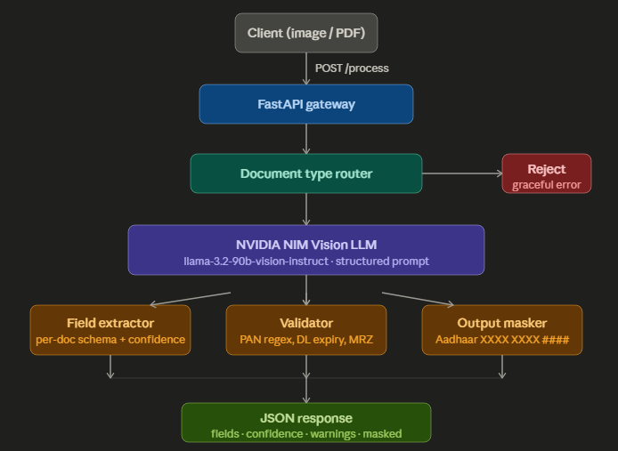

# KYC Document Processing Pipeline

API service for Indian identity documents: classify a scan, extract structured fields with confidence, validate high-risk fields, and return JSON with **mandatory Aadhaar masking**. Vision is powered by **NVIDIA NIM** (`meta/llama-3.2-90b-vision-instruct`); rules (PAN format, driving licence expiry, passport MRZ) run in code after the model.

---

## Demo

Playback works in the browser on GitHub (use the controls to play). If the embed does not load, open the file in the repo: [`Demo video/Untitled design.mp4`](Demo%20video/Untitled%20design.mp4).

<video src="Demo%20video/Untitled%20design.mp4" controls playsinline width="100%">
  <a href="Demo%20video/Untitled%20design.mp4">Download or open the demo video</a>
</video>

---

## Architecture

High-level flow: **client** sends `POST /process` with an image or PDF; **FastAPI** receives it; a **document type router** (vision classification in the structured JSON response) rejects unsupported types; **NVIDIA NIM Vision LLM** performs extraction; then **field extraction**, **validators**, and the **output masker** run before a single **JSON response** (fields, confidence, warnings, masked flags).



| Stage | Role |
|--------|------|
| **FastAPI gateway** | HTTP entry, upload limits, error mapping. |
| **Document type router** | Maps vision output to one of five supported types or rejects with `422`. |
| **NVIDIA NIM Vision LLM** | `llama-3.2-90b-vision-instruct` with a structured JSON prompt (handles skew, blur, Hindi/regional text). |
| **Field extractor** | Per-document field map plus `field_confidence` from the model output. |
| **Validator** | PAN regex, driving licence expiry vs today, passport MRZ check digits vs extracted biographics. |
| **Output masker** | Aadhaar shown only as `XXXX XXXX ####` in API responses; logging avoids raw PII. |

For deeper design notes, see [ARCHITECTURE.md](ARCHITECTURE.md).

---

## Supported documents

| Type | Key fields | Notes |
|------|------------|--------|
| **Aadhaar** | Name, DOB, gender, address, Aadhaar number | First 8 digits never returned. |
| **PAN** | Name, father's name, DOB, PAN | Format `AAAAA9999A`. |
| **Voter ID** | Name, father's or husband's name, DOB, EPIC, address, constituency | |
| **Driving licence** | Name, DOB, DL number, validity, vehicle classes, address | Expiry must be in the future. |
| **Passport** | Name, DOB, passport number, nationality, expiry, MRZ | MRZ cross-checked with extracted fields. |

---

## Quick start

```powershell
cd "KYC Document Processing Pipeline"
python -m venv .venv
.\.venv\Scripts\Activate.ps1
pip install -r requirements.txt
copy .env.example .env
```

Set `NIM_API_KEY` in `.env` and use `USE_MOCK_VISION=false` for real NIM calls. Use `USE_MOCK_VISION=true` only for offline demos.

```powershell
uvicorn app.main:app --reload --host 127.0.0.1 --port 8000
```

Open [http://127.0.0.1:8000/docs](http://127.0.0.1:8000/docs) for interactive API documentation.

---

## API

| Method | Path | Description |
|--------|------|-------------|
| `GET` | `/health` | Liveness. |
| `POST` | `/process` | `multipart/form-data` field **`file`**: `.png`, `.jpg`, `.jpeg`, or `.pdf` (first page rasterized). |

Example (PowerShell):

```powershell
curl -X POST http://127.0.0.1:8000/process -F "file=@tests/fixtures/synthetic_pan.png"
```

Unsupported documents return **422** with `error: unsupported_document`, `detail`, and `supported_types`.

---

## Configuration

| Variable | Purpose |
|----------|---------|
| `NIM_API_KEY` | Bearer token for [NVIDIA integrate](https://build.nvidia.com/) API. |
| `NIM_BASE_URL` | Default: `https://integrate.api.nvidia.com/v1` |
| `VISION_MODEL` | Default: `meta/llama-3.2-90b-vision-instruct` |
| `USE_MOCK_VISION` | `true` = fixed stub response (no NIM). |
| `MAX_UPLOAD_MB` | Maximum upload size (default: 15). |
| `REQUEST_TIMEOUT_S` | Upstream vision timeout (default: 120). |

---

## Response shape (success)

JSON includes:

- `document_type`, `confidence`, `fields`, `field_confidence`, `masked`, `extraction_warnings`

Aadhaar numbers appear only as **`XXXX XXXX ####`**.

---

## Tests and fixtures

```powershell
pytest -q
python scripts/generate_fixtures.py
```

Stubbed pipeline tests cover Aadhaar masking, PAN validation, passport MRZ alignment, unsupported rejection, and voter/degraded scenarios. See `tests/test_set_manifest.json` for a fixture index.

---

## Security

Do not log full LLM responses in production. This project logs high-level metadata only and applies log filters for Aadhaar-like digit runs. **Never commit real API keys**; keep secrets in `.env` (gitignored).

---

## Repository layout (short)

| Path | Purpose |
|------|---------|
| `app/main.py` | FastAPI app and routes. |
| `app/pipeline/` | Loader, NIM client, prompts, process orchestration, mask, MRZ, validate. |
| `Demo video/Untitled design.mp4` | Screen recording demo (embedded in README). |
| `Architecture/Architecture.png` | System architecture diagram. |
| `ARCHITECTURE.md` | Written architecture rationale. |
| `tests/` | Pytest suite and synthetic PNG fixtures. |
